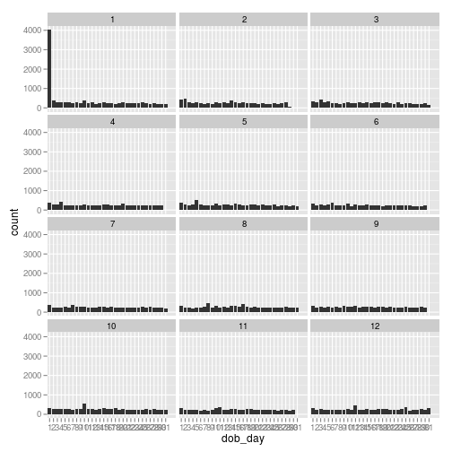

Title
========================================================

This is an R Markdown document. Markdown is a simple formatting syntax for authoring web pages (click the **MD** toolbar button for help on Markdown).

When you click the **Knit HTML** button a web page will be generated that includes both content as well as the output of any embedded R code chunks within the document. You can embed an R code chunk like this:


```r
library(ggplot2)
library(knitr)
setwd('/home/rahim/DelGitGub/UdaCity/EDA/Lesson3');
getwd();
```

```
## [1] "/home/rahim/DelGitGub/UdaCity/EDA/Lesson3"
```

```r
list.files();
```

```
## [1] "FBMD1.html"          "FBMD1.md"            "FBMD1.Rmd"          
## [4] "figure"              "NA"                  "pseudo_facebook.tsv"
## [7] "script1.R"
```

```r
pf <- read.csv('pseudo_facebook.tsv', sep="\t");
qplot(x = dob_day, data=pf) +
  scale_x_discrete(breaks=1:31)+
  facet_wrap(~dob_month, ncol=3)
```

 

```r
########
#qplot(x = friend_count, data=pf, xlim=c(0,1000))

qplot(x = friend_count, data=subset(pf, !is.na(gender)), binwidth=25)+
  scale_x_continuous(limits=c(0,1000), breaks=seq(0,1000,50))+
  facet_wrap(~gender)
```

 

```r
########
table(pf$gender)
```

```
## 
## female   male 
##  40254  58574
```

```r
by(pf$friend_count,pf$gender,summary)
```

```
## pf$gender: female
##    Min. 1st Qu.  Median    Mean 3rd Qu.    Max. 
##       0      37      96     242     244    4920 
## -------------------------------------------------------- 
## pf$gender: male
##    Min. 1st Qu.  Median    Mean 3rd Qu.    Max. 
##       0      27      74     165     182    4920
```

```r
#######
#Tenure

ggplot(aes(x = tenure), data = pf) +
   geom_histogram(binwidth = 30, color = 'black', fill = '#099DD9')
```

 

```r
ggplot(aes(x = tenure / 365), data = pf) +
  geom_histogram(color = 'black', fill = '#F79420') +
  scale_x_continuous(breaks = seq(1, 7, 1), limits = c(0, 7)) +
  xlab('Number of years using Facebook') +
  ylab('Number of users in sample')
```

```
## stat_bin: binwidth defaulted to range/30. Use 'binwidth = x' to adjust this.
```

 

```r
#######
#AGE 
ggplot(aes(x = age), data = pf) +
  geom_histogram(color = 'black', fill = 'green', binwidth=1) +
  scale_x_continuous(breaks = seq(10, 110, 1), limits = c(10, 110)) +
  xlab('Age') +
  ylab('Number of users in sample')
```

 

```r
#######
#Transforming 
install.packages("gridExtra")
```

```
## Installing package(s) into '/home/rahim/R/x86_64-pc-linux-gnu-library/2.14'
## (as 'lib' is unspecified)
```

```
## Error: trying to use CRAN without setting a mirror
```

```r
library(gridExtra)
```

```
## Loading required package: grid
```

```r
 p1 = qplot(x = friend_count, data=subset(pf, !is.na(gender)))+
  geom_histogram(color='black', fill='#0990D9', binwidth=50)+
  scale_x_continuous(limits=c(0,1000))

 p2 = qplot(x = log10(friend_count+1), data=subset(pf, !is.na(gender)))+
  geom_histogram(color='black', fill='#0900D9')+
   scale_x_continuous(limits=c(0,4.001))
 p3 = qplot(x = sqrt(friend_count), data=subset(pf, !is.na(gender)))+
  geom_histogram(color='black', fill='#0090D9')+
   scale_x_continuous(limits=c(0,80))

grid.arrange(p1,p2,p3, ncol=1)
```

```
## stat_bin: binwidth defaulted to range/30. Use 'binwidth = x' to adjust this.
## stat_bin: binwidth defaulted to range/30. Use 'binwidth = x' to adjust this.
## stat_bin: binwidth defaulted to range/30. Use 'binwidth = x' to adjust this.
## stat_bin: binwidth defaulted to range/30. Use 'binwidth = x' to adjust this.
## stat_bin: binwidth defaulted to range/30. Use 'binwidth = x' to adjust this.
```

 

```r
#using ggplot 

 p11 <- ggplot(aes(x = friend_count), data=subset(pf, !is.na(gender)))+
  geom_histogram(color='black', fill='#0990D9')+
  scale_x_continuous(limits=c(0,1000))

 p22 <- p11+ scale_x_log10()
```

```
## Scale for 'x' is already present. Adding another scale for 'x', which will replace the existing scale.
```

```r
 p33 <- p11+ scale_x_sqrt()
```

```
## Scale for 'x' is already present. Adding another scale for 'x', which will replace the existing scale.
```

```r
grid.arrange(p11,p22,p33, ncol=1)
```

```
## stat_bin: binwidth defaulted to range/30. Use 'binwidth = x' to adjust this.
## stat_bin: binwidth defaulted to range/30. Use 'binwidth = x' to adjust this.
## stat_bin: binwidth defaulted to range/30. Use 'binwidth = x' to adjust this.
```

 

```r
#freqplot
ggplot(aes(x = friend_count, y = ..count../sum(..count..)), data = subset(pf, !is.na(gender))) +
  geom_freqpoly(aes(color = gender), binwidth=50) +
  scale_x_continuous(limits = c(350, 1000), breaks = seq(0, 1000, 50)) +
  xlab('Friend Count') +
  ylab('Percentage of users with that friend count')
```

```
## Warning: Removed 2 rows containing missing values (geom_path).
## Warning: Removed 2 rows containing missing values (geom_path).
```

 

```r
ggplot(aes(x = www_likes, y = ..count../sum(..count..)), data = subset(pf, !is.na(gender))) +
  geom_freqpoly(aes(color = gender)) +
  scale_x_continuous(limits = c(0, 1000), breaks = seq(0, 1000, 50)) +
  scale_y_log10()+
  xlab('WWW Links') +
  ylab('Percentage of users with that friend count')
```

```
## stat_bin: binwidth defaulted to range/30. Use 'binwidth = x' to adjust this.
```

```
## Warning: Removed 2 rows containing missing values (geom_path).
## Warning: Removed 2 rows containing missing values (geom_path).
```

 

```r
# plot based on count 
ggplot(aes(x = www_likes), data = subset(pf, !is.na(gender))) +
  geom_freqpoly(aes(color = gender)) +
  scale_x_log10()
```

```
## stat_bin: binwidth defaulted to range/30. Use 'binwidth = x' to adjust this.
```

 

```r
by(pf$www_likes, pf$gender, sum)
```

```
## pf$gender: female
## [1] 3507665
## -------------------------------------------------------- 
## pf$gender: male
## [1] 1430175
```
