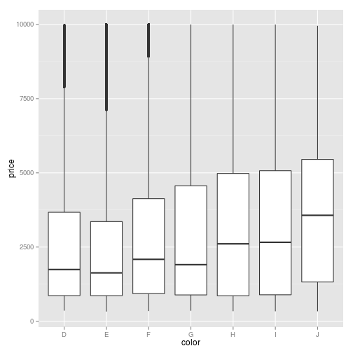
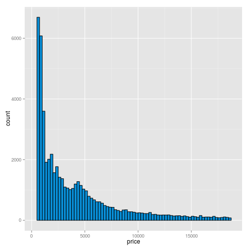
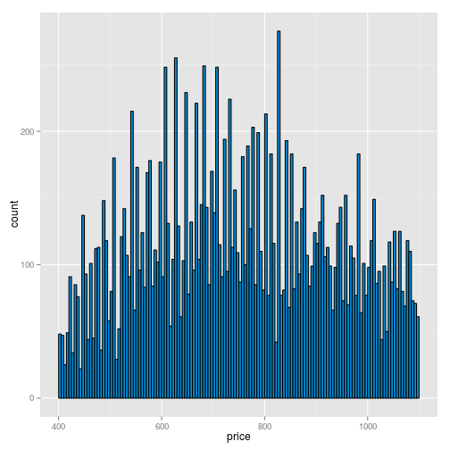
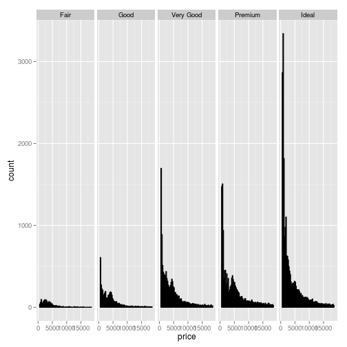

Title
========================================================

This is an R Markdown document. Markdown is a simple formatting syntax for authoring web pages (click the **MD** toolbar button for help on Markdown).

When you click the **Knit HTML** button a web page will be generated that includes both content as well as the output of any embedded R code chunks within the document. You can embed an R code chunk like this:


```r
library(ggplot2)
library(stats)
library(knitr)
dim(diamonds)
```

```
## [1] 53940    10
```

```r
#show the list of types for each column
lapply(diamonds,class)
```

```
## $carat
## [1] "numeric"
## 
## $cut
## [1] "ordered" "factor" 
## 
## $color
## [1] "ordered" "factor" 
## 
## $clarity
## [1] "ordered" "factor" 
## 
## $depth
## [1] "numeric"
## 
## $table
## [1] "numeric"
## 
## $price
## [1] "integer"
## 
## $x
## [1] "numeric"
## 
## $y
## [1] "numeric"
## 
## $z
## [1] "numeric"
```

```r
#what color represents the best diamonds based on price 
qplot(x = color, y=price, data =subset(diamonds, !is.na(color)),
      geom = 'boxplot')+scale_y_continuous(lim=c(300,10000))
```

```
## Warning: Removed 5222 rows containing non-finite values (stat_boxplot).
```

 

```r
#price histogram 
 ph <- ggplot(aes(x = price), data=diamonds)+
  geom_histogram(color='black', fill='#0990D9', binwidth=250)+
  scale_x_continuous(limits=c(300,18825))
ph
```

 

```r
summary(diamonds$price)
```

```
##    Min. 1st Qu.  Median    Mean 3rd Qu.    Max. 
##     326     950    2400    3930    5320   18800
```

```r
## Diamond counts
sum(diamonds$price < 500)
```

```
## [1] 1729
```

```r
sum(diamonds$price < 250)
```

```
## [1] 0
```

```r
sum(diamonds$price >= 15000)
```

```
## [1] 1656
```

```r
#cheaper diamonds
ggplot(aes(x = price), data=diamonds)+
  geom_histogram(color='black', fill='#0990D9', binwidth=5)+
  scale_x_continuous(limits=c(400,1100))
```

 

```r
#price by cut hist
ggplot(aes(x = price), data=diamonds, )+
  geom_histogram(color='black', fill='#0990D9', binwidth=250)+
  scale_x_continuous(limits=c(300,18825))+
  # facet_wrap(~cut, nrow=5)
 facet_grid(~cut)
```

 

You can also embed plots, for example:


```r
plot(cars)
```

 

